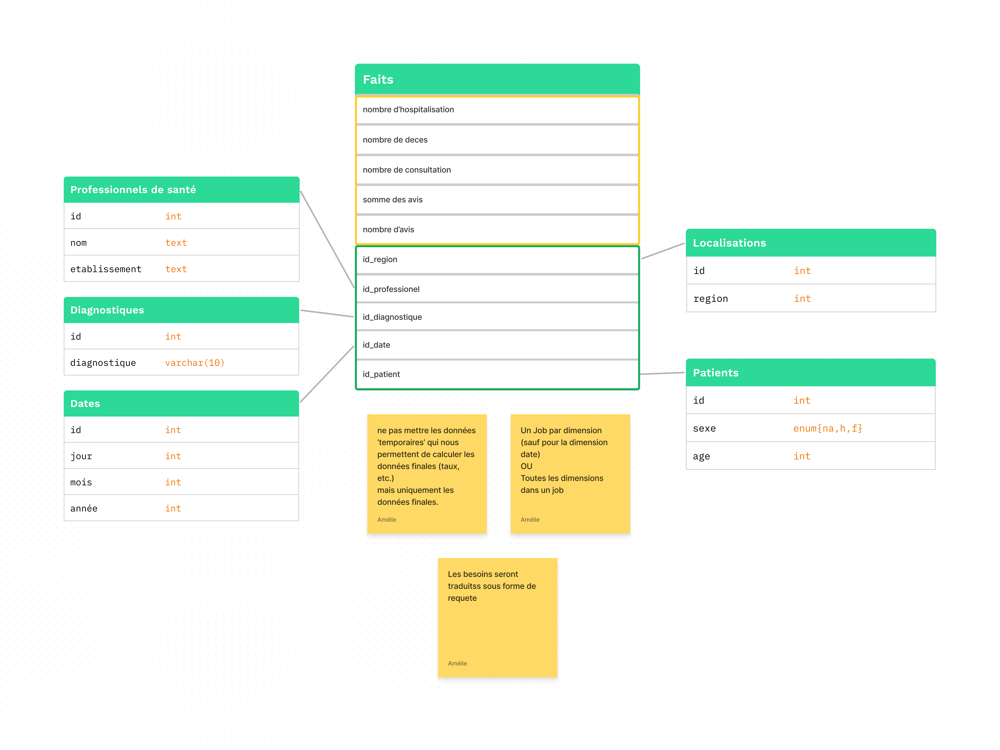

Big Data: Referentiel des donnees
=================================

Ce rapport illustre les differentes manieres dont nous travaillons avec les donnees fournies, de facon a arriver a nos fins.

Nous verrons en detail l'architecture utilisee, et les differents programmes et phases par lesquelles nos donnees sont passees.

Nous etudierons en detail les donnees recoltees a la suite de ce livrable dans le prochain.

Modele dimensionnel des donnees
-------------------------------

Ce schema represente un modele dimensionnel en etoile.

Le modele en etoile a un avantage principal: Il minimise les jointures, ce qui est extremement important en Big Data. De plus, vu que l'on travail avec Hive, et que Hive nous restraint sur le nombre de jointures.

Il a aussi des inconveniants, tels que la de-normalisation partielle de certaines donnees, mais dans notre cas, la vitesse d'execution est plus importante que l'espace pris.

Il existe d'autre modeles, tels que en flocon, ou meme en constellation, que l'on a juge moins adapte a nos besoins et qui ne seront donc pas decris icis.

La table centrale est la table de fait. Elle pourrait etre decoupee en 2 parties:

-	Vert: Liens avec les dimensions autour
-	Jaune: Donnees calculees. Dans notre cas specifique, elles representent les donnees par jour, et par region.

Elle represente les donnees qui nous interessent reelement, et sur lesquelles nous basons nos analyses.

Nous avons besoins d'autre tables autour de la table de Fait, pour etendre nos relations et obtenir un contexte plus pousse pour nos analyses, tout en gardant une certaine forme de normalisation.

Chaque table autour de la table de fait est donc appellee une table de dimension, car elle donne des *dimensions* a nos donnees, elle les contextualise et les rends exploitable.

Le nom de model en etoile est assez simple a comprendre avec ces informations: la table de fait represente le corps de l'etoile, et chaque dimension une de ces branches.

Ce schema de la documentation microsoft powerBI la represente de facon tres explicite: 

Pour en apprendre plus sur les schemas en etoile, vous trouverez [ici](https://docs.microsoft.com/fr-fr/power-bi/guidance/star-schema) des explications plus poussees sur les nombreux avantages qu'elle nous fournit.

Dans notre cas, nous avons fait le choix d'avoir 5 dimensions:

-	Professionels de sante:
    -	Taux de consultation des patients dans un établissement X
    -	Taux de consultation par professionnel
-	Diagnostiques
    -	Taux de consultation des patients par rapport à un diagnostic X sur une période de temps Y
    -	Taux d'hospitalisation des patients par rapport à des diagnostics sur une période donnée
-	Dates
    -	Taux de consultation des patients dans un établissement X sur une période de temps Y
    -	Taux de consultation des patients par rapport à un diagnostic X sur une période de temps Y
    -	Taux global d'hospitalisation des patients dans une période donnée Y
    -	Nombre de décès par localisation (région) et sur l'année 2019
    -	Taux global de satisfaction par région sur l'année 2020
-	Patients
    -	Taux d'hospitalisation/consultation par sexe, par âge
-	Localisation
    -	Nombre de décès par localisation (région) et sur l'année 2019

Ces dimensions sont intemement liees aux besoins des decideurs, car nous ne souhaitons ne stoquer que les donnees necessaires, mais il faut evidemment en stoquer assez.

Une fois notre modele choisis, il nous faut transformer nos donnees sources, tres disparates, de facon a les integrer pour pouvoir operer dessus.

Architecture
------------

L'architecture exposee ci-dessous est composee de 3 parties :

-	Les sources
	-	Fichiers CSV (UTF-8)
	-	Fichiers Excel (xlsx, UTF-8)
	-	Base de donnee Postgres (`pg://postgres:cesi@localhost:5432/soins_medico_administratifs`)
-	Les transformations
-	Les sorties

Nos entrees n'ont pas de relations 1-1 avec nos sorties, et certaines sorties sont composees d'aggregats d'autres sorties, telle que la table de fait.

Nous avons donc des etapes intermediaires. Il nous faut par exemple stoquer les transformations des dimensions pour remplir la table de fait. De plus, les dimensions elle-memes peuvent dependre d'autre dimensions, ou tout simplement d'autre aggregats.

Nous utilisons plusieurs etapes intermediaires de facon a reduire les transformations necessaires, et nous utilisons donc des fichiers delimites (CSV) en tant que cache de fortune, que l'on stoque dans l'HDFS.

Toutes les differentes transformations nous permettent de construire les differentes dimensions, avec lesquelles nous pouvons creer notre table de fait finale.

En fonction de nos besoins, la construction de notre table de fait va differer. Ici, nous avons fait le choix de stoquer les faits en fonction de 3 dimensions clefs: `jour`, `sexe` et `region`, qui vont nous permettre d'avoir des mesures assez precise sans avoir trop d'impact sur le temps d'execution de nos requetes plus tard.
Ces dimensions choisies ont aussi un autre role: il nous est possible de partitionner les tables dans Hive avec ces dimensions, ce qui nous permet encore de reduire les temps de requetes. L'avantage est donc double, puisque nous gagnons du temps d'execution, et que nous n'avons que tres peu de transformations a effectuer pour le partitionnement.

